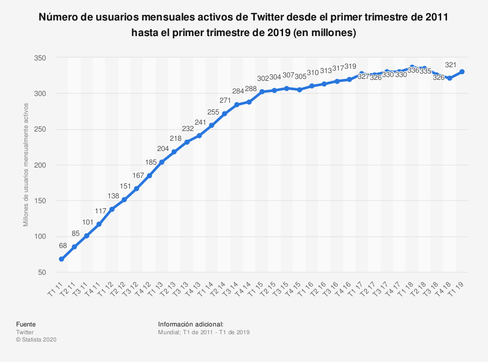
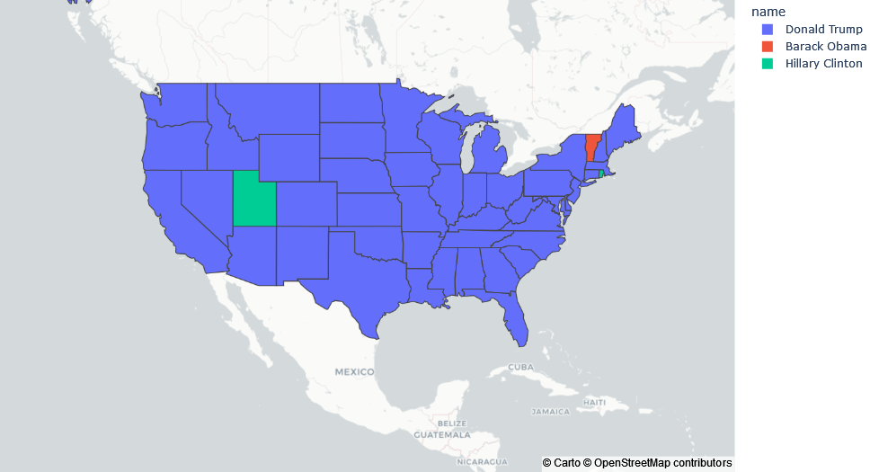
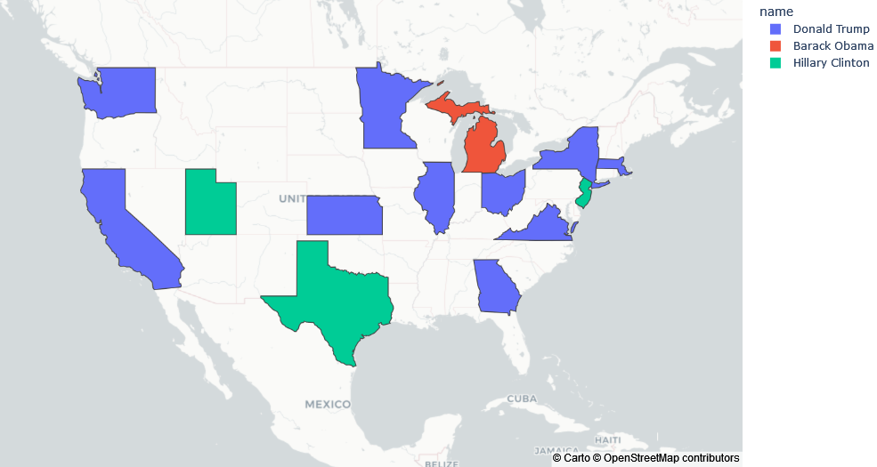
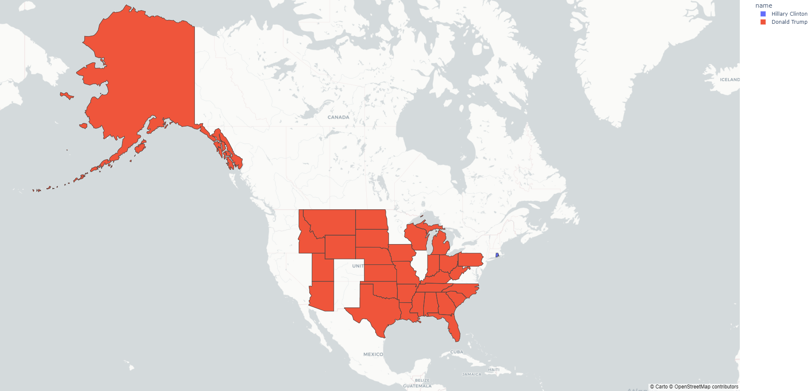
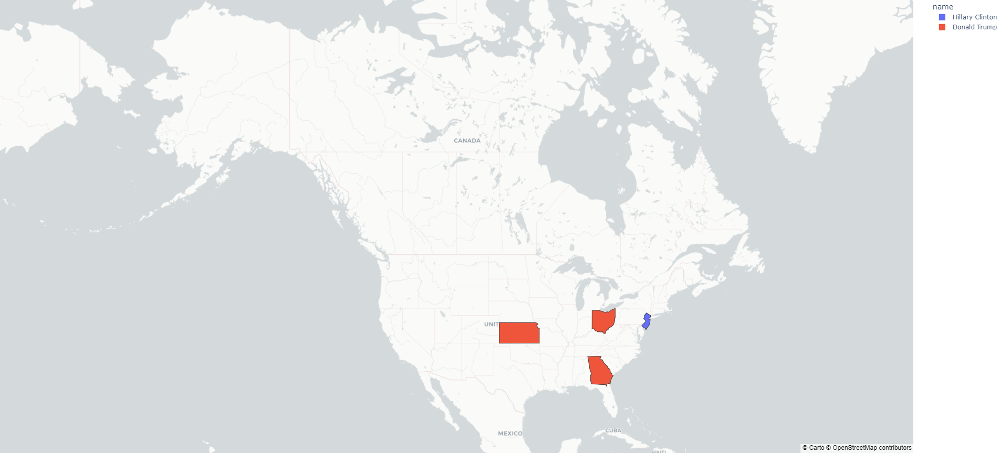
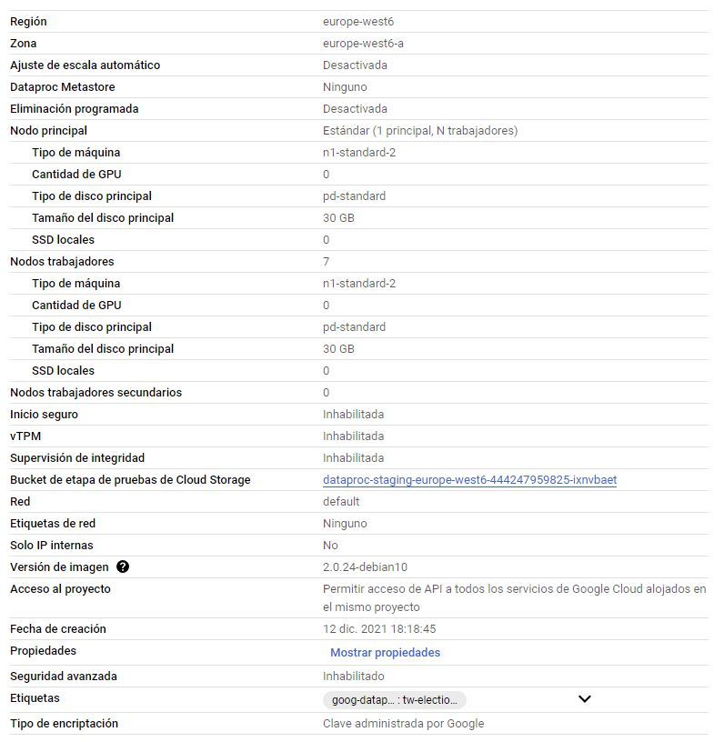

## Descripción del proyecto

Con este proyecto queremos estudiar el reflejo de la sociedad en las redes sociales y el efecto de las mismas en el caso de las elecciones presidenciales de Estados Unidos de 2016. Además, analizar cómo Twitter se ha consolidado como una herramienta esencial para la campaña electoral. Partimos de la hipótesis de que durante el periodo electoral los tweets son representativos de los resultados finales. Es decir, que un mayor flujo de tweets positivos referentes a un candidato representa el apoyo que luego tendrá en los resultados. Asimismo, un flujo de tweets negativos, significará un menor apoyo hacia un candidato.

### Necesidad de Big Data

En los últimos diez años, el número de usuarios mensuales de Twitter ha aumentado en un 372%. A raíz de esto contamos con un dataset del orden de millones de tweets. Es usual que el tráfico de tweets aumente considerablemente durante sucesos importantes. Esto ocurre también durante el periodo electoral de EEUU. Esto constituye un conjunto de datos tan masivo que es necesario el uso de herramientas de procesamiento de datos más potentes como el Cloud.



### Dataset tweets

El dataset lo hemos obtenido de la página data.world, que contiene millones de datasets públicos para que cualquier persona pueda hacer uso de ellos. [Nuestro dataset](https://data.world/alexfilatov/2016-usa-presidential-election-tweets/workspace/project-summary?agentid=alexfilatov&datasetid=2016-usa-presidential-election-tweets) en concreto contiene tweets de las elecciones presidenciales de EEUU de 2016. Hay dos versiones del dataset, uno de 17.3MB y otro de 13.17GB. Para nuestras pruebas en local hemos usado el dataset de 17.3MB, que contiene 100k tweets.

La estructura del dataset es la siguiente: id, candidate_id, tweet_id, polarity, subjectivity, retweet_count, favorite_count, device, retweeted_status_id, lang, state, tweet_text, created_at, inserted_at, updated_at, tw_user_id, latitude, longitude

Para el análisis, hemos prescindido de algunas columnas ya que no aportan información relevante. Así que la estructura que realmente hemos utilizado es la siguiente: candidate_id, polarity, state, created_at. 

**candidate_id:** contiene un número del 1 al 4. Las correspondencias de id-nombre son las siguientes:

* ID 1: Hillary Clinton
* ID 2: Donald Trump
* ID 3: Barack Obama
* ID 4: Bernie Sanders


**polarity:** la polaridad está ya calculada usando [Python NTLK open source server](https://github.com/topics/nltk-python), el que se ha usado es en conctreto un analizador de sentimiento que utiliza TextBlob: [https://github.com/sguignot/textblob-api-server](https://github.com/sguignot/textblob-api-server). La polaridad es un número entre -1 y 1, cuanto más cercana a -1, implica una opinión negativa y 1 positiva.


**state:** contiene abreviaciones tanto de estados de EEUU como de países.


**created_at:** fecha en la que se publicó el tweet.

### Dataset datos reales
También hemos usado un [dataset](https://dataverse.harvard.edu/dataset.xhtml?persistentId=doi:10.7910/DVN/LYWX3D) con los resultados de las elecciones obtenidos en la realidad, con los ganadores por estados. Esto lo hemos obtenido de la plataforma 'Dataverse' de la Universidad de Harvard, por lo que asumimos que los resultados son veraces. El tamaño de este dataset son 528,47 KB, en los que se encuentran los datos en forma tabular. Su estructura es la siguiente: year,"stage","special","state","state_postal","state_fips","state_icpsr","county_name","county_fips",
"county_ansi","county_lat","county_long","jurisdiction","precinct","candidate",
"candidate_normalized","office","district","writein","party","mode","votes","candidate_opensecrets",
"candidate_wikidata","candidate_party","candidate_last","candidate_first","candidate_middle",
"candidate_full","candidate_suffix","candidate_nickname","candidate_fec","candidate_fec_name",
"candidate_google","candidate_govtrack","candidate_icpsr","candidate_maplight".

De todos estos datos, sólo necesitábamos saber los datos relacionados con los votos totales por estados (formado por contados -'county_name' en la tabla-), el nombre del estado al que pertenecen y el nombre del candidato ganador. Por esto, hemos seguido la siguiente estructura para trabajar de una manera más eficiente: "state_postal", "county_name", "candidate_normalized" y "votes". 

**state_postal:** abreviatura del estado al que pertenece el condado.


**county_name:** nombre del condado.


**candidate:** nombre del candidato ganador en un condado.


**votes:** número de votos contabilizados para el ganador de las elecciones en un condado.


### Objetivos

El principal objetivo del proyecto es demostrar que el número de tweets referentes a un candidato guarda relación con los resultados obtenidos en las elecciones. Para ello, hemos analizado los tweets en función de su polaridad para hacer un mapa que represente la imagen que tienen los usuarios de Twitter de cada candidato en cada estado. Vamos a comparar estos datos obtenidos con los resultados reales para hacer el análisis estadístico.

Otro de los objetivos de este proyecto es reafirmar que es necesario el uso de un procesamineto de datos más potente. Para ello vamos a realizar pruebas de manera local, sobre un ordenador, y sobre un clúster en Google Cloud. 

También hemos querido ver cómo se refleja Twitter en la sociedad. Para ello hemos analizado el dataset con los resultados reales de las elecciones para posteriormente contrastar estos resultados con el análisis obtenido de los tweets.

### Desarrollo

Hemos desarrollado nuestro programa con Spark. Para poder ejecutarlo el usuario deberá tener instalado en su ordenador pyspark. Para instalarlo hemos seguido las instrucciones de la siguiente [página](https://medium.com/tinghaochen/how-to-install-pyspark-locally-94501eefe421).

Lo primero que realizamos fue la limpieza de los datos para quedarnos con las columnas que nos interesaban. Estas son: 'candidate_id', 'polarity', 'subjectivity', 'state', 'created_at'. Seguidamente descartamos las filas que contenían valores nulos en las columnas 'state' o 'created_at'. Los datos fueron recogidos entre agosto de 2016 y febrero de 2017 cuando Trump asumió el cargo. Filtramos los tweets que pertenecían a los estados de EEUU, en total 51 estados los cuales son: ['OH', 'AZ', 'MO', 'TN', 'ID', 'MA', 'LA', 'CA', 'SC', 'MN', 'NJ', 'DC', 'OR', 'VA', 'RI', 'KY', 'WY', 'NH', 'MI', 'NV', 'WI', 'CT', 'NE', 'MT', 'NC', 'VT', 'MD', 'DE', 'IL', 'ME', 'WA', 'ND', 'MS', 'AL', 'IN', 'IA', 'NM', 'PA', 'SD', 'NY', 'TX', 'WV', 'GA', 'KS', 'FL', 'CO', 'AK', 'AR', 'OK', 'UT', 'HI'].

```python
df.select('candidate_id', 'polarity', 'subjectivity', 'state', 'created_at').filter(df.state.isNotNull() & df.created_at.isNotNull()).filter(df.state.isin(li))
```
Para visualizar los resultados con un mapa, hemos utilizado la librería Plotly que es una librería gráfica que sirve para hacer mapas. Para instalarlo es necesario ejecutar el siguiente comando:

```console
$ pip install plotly==5.4.0
```

Para realizar el análisis hemos diferenciado los resultados por polaridades positivas y negativas. Con esto queremos comprobar si hay alguna relación entre la polaridad positiva y los resultados o si hay relación entre la polaridad negativa y los resultados. Es decir, si el apoyo a los candidatos en Twitter se ve reflejado en los resultados finales. 

**Polaridad positiva**
```python
positive_polarity = candidates_df.filter(candidates_df.polarity >= 0).groupBy('name', 'state').count().withColumnRenamed('count', 'votes')
polarity_results = positive_polarity.sort(positive_polarity.state.asc(), positive_polarity.votes.desc()).groupBy('state').agg(first('name').alias('name')).sort('state')
```

**Polaridad negativa**
```python
negative_polarity = candidates_df.filter(candidates_df.polarity < 0).groupBy('name', 'state').count().withColumnRenamed('count', 'votes')
neg_polarity_results = negative_polarity.sort(negative_polarity.state.asc(), negative_polarity.votes.desc()).groupBy('state').agg(first('name').alias('name')).sort('state')
```

Para un mejor análisis, hemos querido contrastar los resultados de Twitter con los resultados reales. Para ello, nos hemos servido de los datasets creados anteriormente en el estudio de las polaridades. Posteriormente, hemos creado mapas que enseñen estos resultados. El código que sigue hace referencia a cómo hemos hecho las operaciones de 'join' de los datasets citados para obtener este contraste.

**Contraste de resultados positivos**
```python
cond_pos = [real.state_postal == pos.state, real.candidato == pos.name]
pos_contrast = real.join(pos, cond_pos, "inner")
```
**Contraste de resultados negativos**
``` python
cond_neg = [real.state_postal == neg.state, real.candidato == neg.name]
neg_contrast = real.join(neg, cond_neg, "inner")
```
### Resultados

Polaridad positiva 


Polaridad negativa


Contraste resultados positivos


Constraste resultados negativos



### Rendimiento: Local vs Cloud
2 min 52 secs en Cloud.


### Conclusiones
En la mayoría de estados, podemos apreciar en el mapa de constrate de resultados positivos que la mayoría de veces, cuando un candidato 
es popular en la opinión pública -reflejada por Twitter en este caso- suele ganar. Y viceversa, en el caso del contraste de resultados negativos, 
cuando un candidato no es popular, no suele ganar las elecciones. 
De esta manera, podemos establecer una relación proporcional entre las opiniones de los usuarios en la red y los resultados oficiales, siendo mayor
esta relación respecto a los comentarios positivos generados en Twitter.

En resumen, podemos verificar nuestra hipótesis: Existe una fuerte relación entre las opiniones recogidas en redes sociales y la opinión popular, viendo
los resultados obtenidos en los contrastes.
